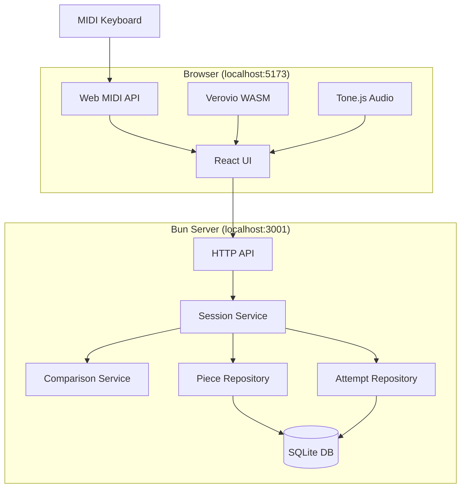
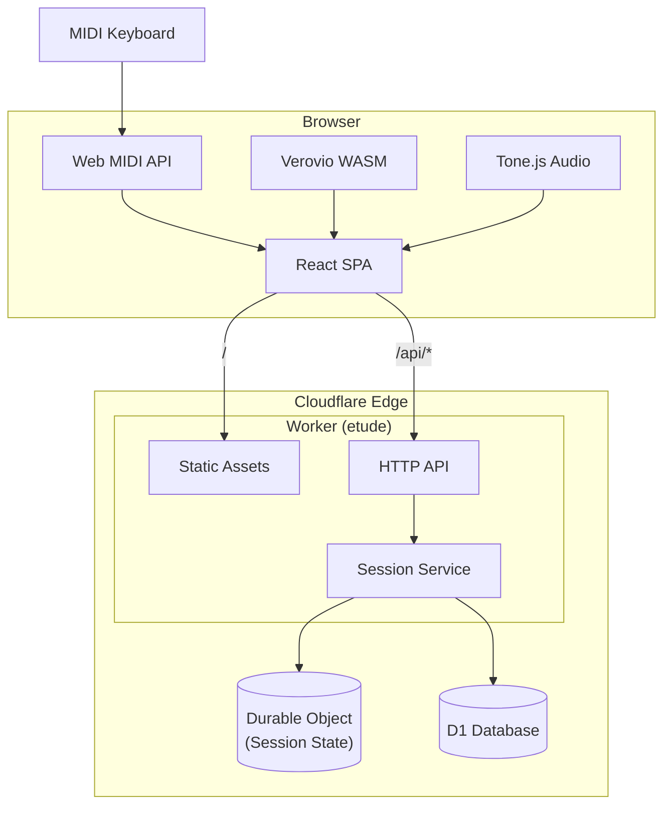
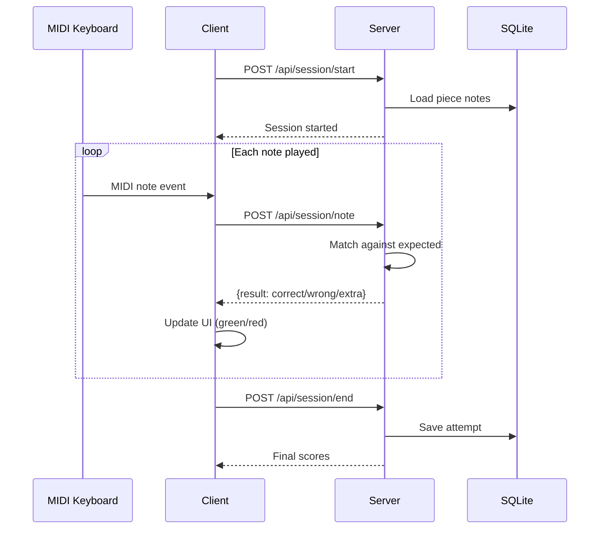

# Etude

A self-hosted piano practice tool that scores your performance against sheet music. Connect a MIDI keyboard, load a piece, play through it, and get real-time feedback on accuracy.

## Why?

Most piano practice tools are subscription-based, cloud-dependent, and over-featured. Etude is a local-first alternative that does one thing well: assess your playing and track progress.

## Features

- **Sheet music rendering** from MusicXML via Verovio
- **MIDI input** via Web MIDI API
- **Real-time feedback** - notes light up green/red as you play
- **Scoring** - note accuracy, timing accuracy, combined score
- **Progress tracking** - history of attempts per piece
- **Audio playback** - hear how the piece should sound

## Requirements

- [Bun](https://bun.sh) runtime
- Chromium-based browser (Chrome, Edge, Brave) - Web MIDI requires this
- MIDI keyboard

## Quick Start

```bash
# Install dependencies
bun install

# Start the server (runs on port 3001)
cd packages/server && bun run dev

# In another terminal, start the client (runs on port 5173)
bun run dev

# Open http://localhost:5173
```

## Architecture

### Local Development



### Production (Cloudflare)



**Infrastructure:**
- **Worker**: Single Cloudflare Worker serving both static SPA and API routes
- **D1 Database**: SQLite-compatible database for pieces and attempts
- **Durable Objects**: Persistent session state (replaces in-memory Ref from local dev)
- **Custom Domain**: etude.vessia.net

### Data Flow



## Project Structure

```
etude/
├── packages/
│   ├── client/          # React + Vite frontend
│   │   ├── src/
│   │   │   ├── components/   # UI components
│   │   │   ├── hooks/        # useMidi, useAudio, useSession
│   │   │   └── App.tsx
│   │   └── package.json
│   │
│   ├── server/          # Bun + Effect backend
│   │   ├── src/
│   │   │   ├── api/          # HTTP routes
│   │   │   ├── services/     # Business logic
│   │   │   ├── repos/        # Database access
│   │   │   ├── main.ts       # Local dev entry point
│   │   │   ├── worker.ts     # Cloudflare Worker entry point
│   │   │   ├── session-do.ts # Durable Object for session state
│   │   │   ├── sql.ts        # SQLite layer (local)
│   │   │   └── sql-d1.ts     # D1 layer (Cloudflare)
│   │   ├── migrations/       # D1 database migrations
│   │   └── package.json
│   │
│   └── shared/          # Shared types & schemas
│       └── src/
│           └── domain.ts     # Branded types, errors
│
├── alchemy.run.ts       # Infrastructure as Code
├── .github/workflows/   # CI/CD
└── package.json         # Workspace root
```

## Tech Stack

| Layer | Technology |
|-------|------------|
| Runtime | Bun (local), Cloudflare Workers (prod) |
| Backend Framework | Effect |
| Database | SQLite (local), D1 (prod) |
| Session State | Ref (local), Durable Objects (prod) |
| Frontend | React + Vite |
| Sheet Music | Verovio (WASM) |
| Audio | Tone.js |
| MIDI | Web MIDI API |
| IaC | Alchemy |
| CI/CD | GitHub Actions |
| Testing | bun:test + bun-test-effect |

## Development

```bash
# Run tests
bun test

# Type check
bun run typecheck

# Lint
bun run lint

# Lint with auto-fix
bun run lint:fix
```

## Deployment

Deployed to Cloudflare Workers via [Alchemy](https://alchemy.run) IaC.

### CI/CD

Pushes to `master` trigger automatic deployment via GitHub Actions:
1. Type check
2. Run tests
3. Build client
4. Deploy with Alchemy

### Manual Deployment

```bash
# Deploy to dev stage
ALCHEMY_STAGE=dev bun run alchemy.run.ts

# Deploy to production
ALCHEMY_STAGE=prod bun run alchemy.run.ts

# Destroy a stage
ALCHEMY_STAGE=dev bun run alchemy.run.ts --destroy
```

### Required Secrets (GitHub Actions)

| Secret | Description |
|--------|-------------|
| `CLOUDFLARE_API_TOKEN` | Cloudflare API token with Workers/D1/DNS permissions |
| `CLOUDFLARE_ACCOUNT_ID` | Cloudflare account ID |
| `ALCHEMY_PASSWORD` | Encryption password for Alchemy state |
| `ALCHEMY_STATE_TOKEN` | Token for CloudflareStateStore |

## How It Works

### Scoring

**Note Accuracy**: Did you play the right notes?
```
note_accuracy = correct_notes / expected_notes
```

**Timing Accuracy**: Did you play them at the right time?
- 75ms grace period = perfect timing
- 150ms tolerance window = full credit
- Beyond tolerance = partial credit based on distance

**Combined Score**:
```
combined = (0.6 * note_accuracy) + (0.4 * timing_accuracy)
```

### Note Matching

Uses greedy matching - each played note matches the nearest unmatched expected note by time. This allows recovery from timing mistakes without double-penalty.

## Configuration

The server reads `DATABASE_PATH` env var (default: `./data/etude.db`).

## License

MIT
